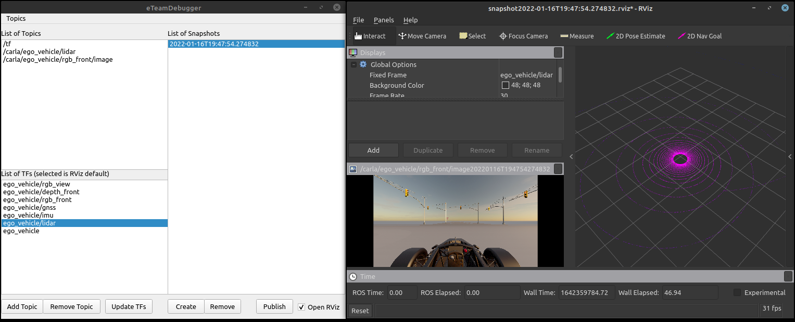

# eTeamDebugger

eTeamDebugger is a python GUI-tool that can help debugging ROS Topics.

## Functionalities

 - Create snapshots of selected topics
 - Import/Export topics list and snapshots
 - Quickly launch rviz already configured for a given snapshot

The application store everything in RAM, but it's not too RAM intensive because it store just the last message for each topic (multiplyed for the number of snapshots you took in that session)

## Requisites

 -  ROS installed with rospy (Tested on noetic)
 - All the Python modules in requirements.txt (psss: you can use `pip install -r requirements.txt` to be sure)

## How to run
Be sure to have your `roscore` running, then you simply have to run `python3 debugger.py`.

## Image
Screenshot of eTeamDebugger with a snapshot open in RViz

